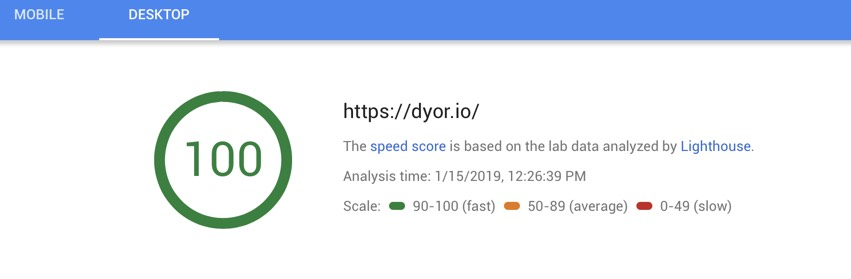
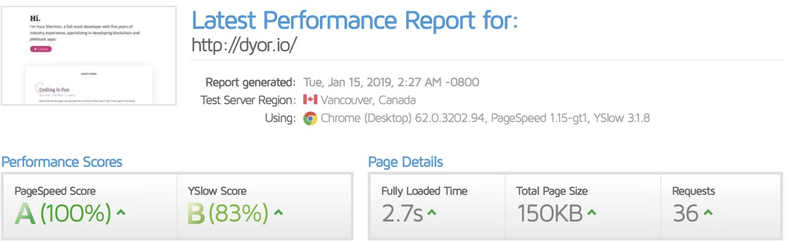

GatsbyJS + Netlify combo shows absolutely incredible performance out of the box. No CDN configurations or other tinkering is required.

Here is what Google's [Pagespeed Insights](https://developers.google.com/speed/pagespeed/insights/) has to say about this website's performance:

And here is the data from [GTMetrix](https://gtmetrix.com):

Now this speed comes right out of the box, without having to set up anything. Seems like the era of tedious configuring of various web servers, CDNs and the like has come to an end thanks to [Netlify](https://netlify.com).
