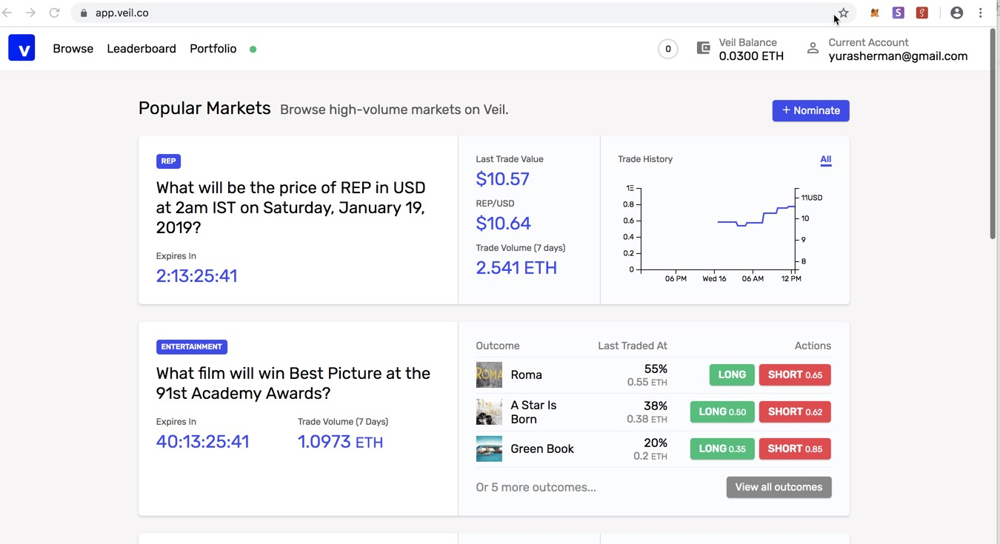
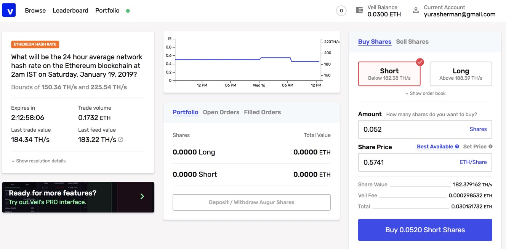
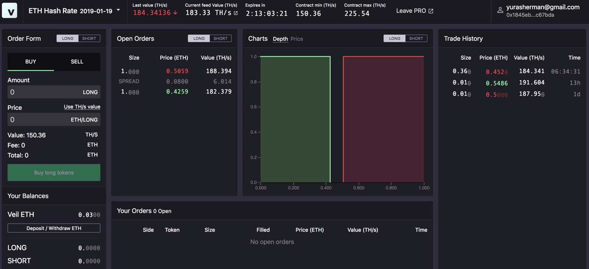
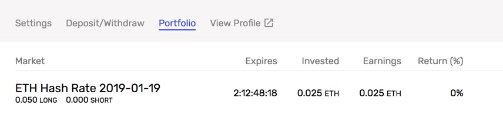

_Veil Market has suspended operations in July 2019 due to low demand_

[Veil](https://veil.co/), a prediction market built on top of Augur,  has officially launched and in this post we're going to try it out.

## What is Veil?

> Veil is a peer-to-peer prediction market and derivatives platform built on top of Augur, 0x, and Ethereum.

Wait, but isn’t Augur a prediction market? Why do we need a prediction market on top of another prediction market? Is it prediction markets all the way down?

Well, Veil is a layer two prediction market, offering two enhancements to the Augur experience:
- Use 0x protocol to speed up trading. Orders are created and canceled off-chain, so only the actual transfer of value happens on Ethereum.
- Instant settlement on selected markets instead of the potentially long finalization on Augur, so you can redeem your earnings for ETH as soon as the market expires.

Veil’s goal is to bring Augur to the masses, so let’s see how well it works.

**Important**: At the moment trading on Veil is not available for US users. This limitation can be bypassed with a VPN, however it's against the terms of service.

## Trying Veil

Here is how the Veil experience goes:

1. Browse to the [Veil app](https://app.veil.co). You will need the [Metamask](https://metamask.io)extension in your desktop browser or any Ethereum wallet if you’re on mobile.
2. Allow Veil to connect to your account in Metamask. [screenshot](./metamask_connect.jpg)
3. Register with your email address.
4. Verify your address by signing a message in Metamask.
5. Choose a username.
6. Fund your account. Here Veil will ask you to transfer some ETH from your wallet to your Veil account. I’ve funded my account with a princely 0.03 ETH ($3.81 as of today).
7. Veil also asks you about the kind of markets you’re interested to trade in. Interestingly enough, there are no options to choose from.

Wow, we’re logged in! Veil still reminds us to verify email but we’re ready to trade.

## Available markets

At the moment (Jan 16th, 2019), only 8 markets are availabe. 
- Betting on cryptocurrency prices (BTC, ETH, ZRX, REP and GRIN)
- Betting on future Ethereum blockchain performance (avg. gas fee and hash rate)
- Betting on the Oscar-winning movie.

However, anyone can nominate an Augur market to be traded on Veil.

## Actual Trading

The Ethereum hash rate market has some liquidity and is tradeable using the modern UI. Yes, Veil has two user interfaces: a modern good-looking one, and a confusing one which looks like a worse Cryptopia and is for some reason called “Veil PRO” (actually, Veil PRO shows the whole order book but we’re not going to use it at the moment).

Modern UI:

"Veil PRO":

I’m longing the Ethereum hash rate (as the Constantinople delaying bug is not serious IMHO) and buying 0.05 shares for the best available price. 

To execute the transaction, I need to sign it from my Metamask. Once I do that, the order is placed.

Now I can see the shares in the ETH Hash Rate market which expires in two and half days, which is when I will update this post with the results.

## Is Veil an Improvement?

Definitely. [Augur’s user experience](https://www.augur.net) is not great (yet), and Veil is much simpler. Fund your account, make a bet on a market, wait until this market resolves and withdraw earnings. I believe that the 1% fee that Veil charges (and additional 1% for instant withdrawal if chosen) is absolutely worth the utility that they provide.

